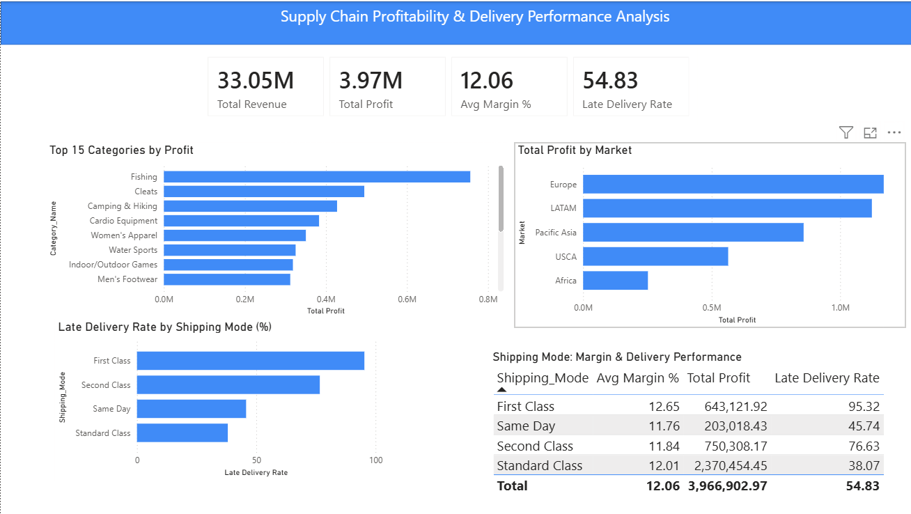

# Supply Chain Profitability & Delivery Performance Analysis

## Business Problem
A global retailer wanted to understand which product categories and markets 
were driving profitability, and whether operational factors like discounting 
and shipping mode were impacting margins.

## Tools Used
- SQL Server (data analysis & window functions)
- Power BI (dashboard)

## Dataset
DataCo Smart Supply Chain dataset — 180,000+ orders across global markets 
covering products, customers, shipping, and financials. Source: Kaggle

## Dashboard

## Key Findings
- Fishing is the most profitable category at $756k, nearly 50% ahead of second 
  place Cleats — top 4 categories drive the majority of total profit
- Europe and LATAM are the strongest markets, each generating over $1.1M profit
- Africa is significantly underperforming despite reasonable margins in some regions
- First Class shipping has a 95.32% late delivery rate — virtually every premium 
  order arrives late, representing a major operational failure
- Standard Class is both the most reliable (38% late rate) and generates the most 
  profit at $2.37M — the business should reconsider its premium shipping offering
- 3 products have negative profit margins and are actively losing money — 
  SOLE E25 Elliptical (-3.6%), SOLE E35 Elliptical (-3%), and Bushnell X7 
  Rangefinder (-2.45%)

## Business Recommendations
1. Investigate and fix First Class shipping operations or discontinue the tier
2. Reprice or discontinue the 3 loss-making products
3. Reduce discounting in high-demand categories like Fishing and Cleats where 
   demand is strong enough to sustain full price

## SQL Techniques Used
- CTEs (Common Table Expressions)
- Window functions (RANK)
- CASE statements for banding
- Aggregations across multiple dimensions
- Joins via single table with grouped analysis

## Files
- 01_profit_by_category.sql
- 02_profit_by_market_region.sql
- 03_discount_impact_on_margin.sql
- 04_late_delivery_by_shipping_mode.sql
- 05_top_bottom_products_by_margin.sql
- dashboard.png
